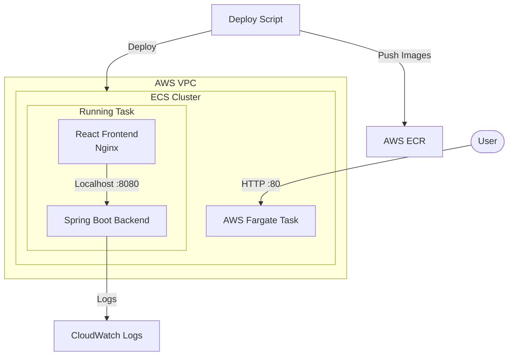

# React + Spring Boot CRUD on AWS ECS

A full-stack CRUD application deployed on AWS ECS Fargate, featuring a Spring Boot backend and a React frontend.

## 🚀 Overview

This project demonstrates a production-ready setup for containerized applications on AWS.
-   **Frontend**: React (Vite) served via Nginx.
-   **Backend**: Spring Boot (Java 17) with REST APIs.
-   **Infrastructure**: AWS ECS Fargate, ECR, CloudWatch Logs.

## 📋 Prerequisites

Before you begin, ensure you have the following installed:

1.  **Git**: [Download Git](https://git-scm.com/downloads)
2.  **Java 17+ (JDK)**: [Download JDK](https://adoptium.net/)
3.  **Node.js & npm**: [Download Node.js](https://nodejs.org/)
4.  **Docker Desktop**: [Download Docker](https://www.docker.com/products/docker-desktop/) (Required for building images)
5.  **AWS CLI**: [Install AWS CLI](https://docs.aws.amazon.com/cli/latest/userguide/getting-started-install.html)

### AWS Setup
You must configure your AWS CLI with credentials that have permissions for ECS, ECR, IAM, and EC2.
```bash
aws configure
# Enter your Access Key, Secret Key, Region (e.g., us-east-1), and Output format (json).
```

## 🛠️ Project Structure

```
aws-spring-react-crud/
├── backend/                 # Spring Boot application
├── frontend/                # React application
├── scripts/                 # Automation scripts
│   ├── deploy.sh            # One-click deployment
│   └── cleanup.sh           # One-click teardown
├── ecs-task-def.json        # AWS ECS Task Definition configuration
├── README.md                # This file
└── WALKTHROUGH.md           # Detailed deployment guide
```

## 🧠 AWS ECS Concepts & Architecture

If you are new to AWS ECS, here is a breakdown of the components used in this project and the order they are created:

### Key Terminology
1.  **ECR (Elastic Container Registry)**: Like Docker Hub, but private on AWS. We store our Docker images here.
2.  **ECS Cluster**: A logical grouping of tasks or services. Think of it as a "namespace" for your application.
3.  **Task Definition**: The "blueprint" for your application. It defines which Docker images to use, how much CPU/RAM they need, and how they talk to each other (e.g., Backend + Frontend).
4.  **Fargate**: The "serverless" compute engine. It runs your containers without you needing to manage EC2 servers.
5.  **Task**: A running instance of your *Task Definition*. This is your actual running application.

### 🔄 Deployment Flow (Order of Operations)

When you run `deploy.sh`, it follows this exact sequence:

1.  **Create Repositories (ECR)**: We need a place to put our code artifacts (Docker images).
2.  **Build & Push Images**: We build the code into containers and upload them to ECR.
3.  **Create Cluster**: We create the "home" for our application on AWS ECS.
4.  **Register Task Definition**: We tell AWS *how* to run our app (which images, ports, etc.).
5.  **Run Task**: We tell AWS to "launch this blueprint" on **Fargate**.

### 🏗️ Architecture Diagram



## ⚡ Deployment Guide (Automated)

We have provided automated scripts to handle the complex AWS operations for you.

### Option A: Shell Scripts (Recommended for Beginners)
Run the deployment script. This will:
-   Create ECR Repositories (if missing).
-   Create an ECS Cluster (if missing).
-   Build Docker images for Backend and Frontend.
-   Push images to AWS ECR.
-   Register the ECS Task Definition.
-   Launch the ECS Task on Fargate.

```bash
cd aws-spring-react-crud
chmod +x scripts/*.sh

./scripts/deploy.sh
```

The script will output the **Public URL** of your application once deployed.

### Option B: Terraform (Infrastructure as Code)
We provide two Terraform targets:

1.  **ECS Fargate (Recommended)**: Inside `terraform/`. Fast and cost-effective.
2.  **EKS (Kubernetes)**: Inside `terraform-eks/`. For production Kubernetes workloads.

```bash
# For ECS
cd terraform && ./deploy.sh nonprod

# For EKS
cd terraform-eks && ./deploy.sh
```
See respective READMEs in those folders for details.

### Option C: VPS (Hostinger/DigitalOcean)
If you want to run this on a cheap Linux server (VPS), you have two choices:

**1. Docker Compose (Simplest)**
See [vps/README.md](vps/README.md).

**2. Kubernetes (K3s)**
If you want to learn K8s or need orchestration.
See [k8s/README.md](k8s/README.md).

### 2. Verify Deployment
Open the URL provided by the script in your browser.
Example: `http://54.x.x.x`

## 🧹 Cleanup (Save Costs)

To avoid incurring charges for running tasks on AWS Fargate, verify you stop the resources when finished.

```bash
./scripts/cleanup.sh
```

This script stops all running tasks. It **does not** delete the ECR images or the ECS Cluster configuration, making it very fast to redeploy later using `./scripts/deploy.sh`.

## 📖 Manual Steps & Details

For a deeper dive into the architecture, manual AWS commands, and troubleshooting, please refer to [WALKTHROUGH.md](WALKTHROUGH.md).
